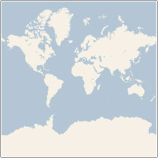
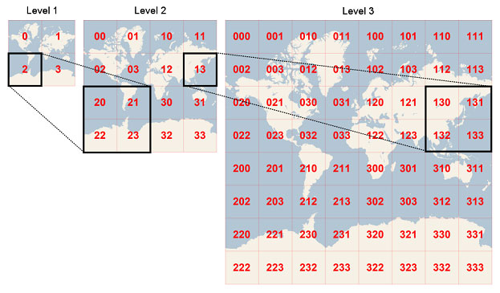

# quadkeytools

## Forked

Forked from [https://bitbucket.org/steele/quadkeytools/src/master](https://bitbucket.org/steele/quadkeytools/src/master)

## Describe

A library to calculate unique keys that represent tiles in a quadtree grid for geo-coordinates.  We will call these unique keys quadkeys. This was based off code put out by the Bing maps team <http://msdn.microsoft.com/en-us/library/bb259689.aspx>

## About

### Projection

In order to map a 2D plane on to the globe you have to use projection.  This library uses Mercator projection.  Which looks like this:



### Detail Level

Once the globe is projected on to a 2D plane we can cut it up into quadrants then quadruple it's area and cut each quadrant into subquadrants.  Each time the plane is increased in size we increase the detail level of each quadrant.  

### QuadkeyTools

Every time we increase the detail level we mark each subquadrant with a 0, 1, 2, or 3.  Looks something like this:



## Installation

npm install quadkeytools

## Usage

### locationToQuadkey( location, detail )

Get the quadkey for lat,lng at a specific detail

```js
import { locationToQuadkey } from "quadkeytools";
const location = { lat: 40.01234, lng: -160.02324 };
const detail = 16;
const key = locationToQuadkey(location, detail);
```

### bbox( quadkey )

Get the bounding box for a quadkey.  Detail level is inferred by the length of the key.

```js
import { bbox } from "quadkeytools";
const key = '11002122';
const bbox = bbox(key);
```

### origin( quadkey )

Get the center origin lat,lng of a quadkey

```js
import { origin } from "quadkeytools";
const key = '12332110';
const origin = origin(key);
```

### inside( location, quadkey )

Check if a lat,lng is within the bounds of a quadkey.  Returns true if the location is inside the quadkey and false otherwise.  Detail level is inferred by the size of the key.

```js
import { inside } from "quadkeytools";
const key = '00231211';
const location = { lat: 40.01234, lng: -160.02324 };
const isInside = inside(location, key);
```

### children( quadkey )

Get all the children of a quadkey.  This will return an array of keys representing the subquadrants at the next detail level.

```js
import { children } from "quadkeytools";
const key = '0123332111';
const children = children(key);
```

### sibling( quadkey, direction )

Get a sibling of a quadkey.  This will return the key of a sibling in a particular direction.  Directions can be 'left' 'right' 'up' or 'down'.

```js
import { sibling } from "quadkeytools";
const key = '001';
const sibling = sibling(key, 'left');
```

### parent( quadkey )

Get the parent of a quadkey.  This will return the quadkey that represents the parent quadrant in the previous detail level.

```js
import { parent } from "quadkeytools";
const key = '0012223';
const parent = parent(key);
```

### locationToPixel( location, detail )

Convert lat,lng to pixel coordinates.  Note - Pixel coordinates are Integers so precision will be lost.

```js
import { locationToPixel } from "quadkeytools";
const location = { lat: 40.01234, lng: -160.02324 };
const detailLevel = 10;
const pixel = locationToPixel(location, detailLevel);
```

### pixelToLocation( pixel, detail )

Convert pixel coordinates to lat,lng.  

```js
import { pixelToLocation } from "quadkeytools";
const pixel = { x: 14547, y: 99231 };
const location = pixelToLocation(pixel, 10);
```

### pixelToTile( pixel )

Convert pixel coordinates to tile coordinates

```js
import { pixelToTile } from "quadkeytools";
const pixel = { x: 14547, y: 99231 };
const tile = pixelToTile(pixel);
```

### tileToPixel( tile )

Convert tile coordinates to pixel coordinates

```js
import { tileToPixel } from "quadkeytools";
const tile = { x: 12, y: 200 };
const pixel = tileToPixel(tile);
```

### tileToQuadkey( tile, detail )

Convert tile coordinates to a quadkey at a specific detail level

```js
import { tileToQuadkey } from "quadkeytools";
const tile = { x: 220, y: 45 };
const detail = 10;
const key = tileToQuadkey(tile, detail);
```

### quadkeyToTile( quadkey )

Get the tile coordinates of a quadkey. This will be the coordinates of the corner of the quadkey.

```js
import { quadkeyToTile } from "quadkeytools";
const key = '000123220';
const tile = quadkeyToTile(key);
```

### tileToLocation( tile, detail )

Get the lat,lng coordinates of a tile's corner for a specific detail level.

```js
import { tileToLocation } from "quadkeytools";
const tile = { x: 220, y: 12 };
const detail = 4;
const location = tileToLocation( tile, detail );
```
